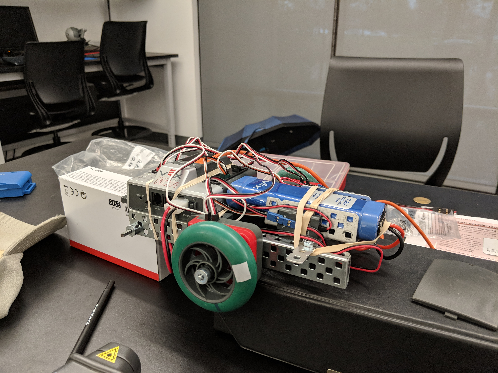
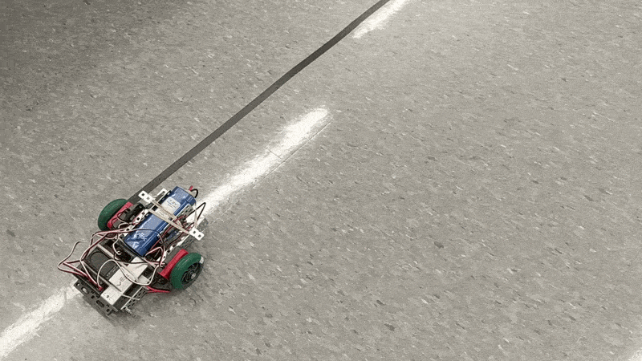
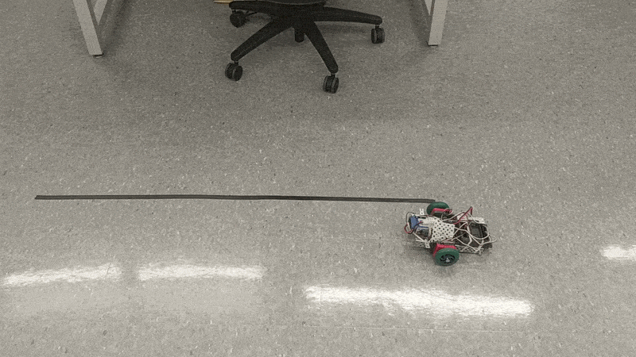

# VEX Robotics — Autonomous Drivetrain Control

Autonomous motion control for a 4-motor VEX EDR differential-drive robot, implemented in RobotC on a VEX Cortex microcontroller. The project moves through four control architectures of increasing sophistication, from pure open-loop timing to closed-loop proportional control on two independent sensor modalities (quadrature encoder, ultrasonic rangefinder).

## Hardware

- **Controller:** VEX Cortex, motor controllers: 269 motors via MC29
- **Drivetrain:** 4-motor differential (tank) drive — `motor1`/`motor3` on one side, `motor2`/`motor4` on the other (reversed for symmetric forward drive)
- **Sensors:** quadrature shaft encoder, SONAR (ultrasonic) rangefinder
- **Language / toolchain:** RobotC

## Control strategies

| # | File | Strategy | Feedback |
|---|------|----------|----------|
| 1 | [01_open_loop_timed_drive.c](VEXProjectCodes/01_open_loop_timed_drive.c) | Open-loop, timed drive | None — runtime derived from an empirically measured speed/power curve |
| 2 | [02_closed_loop_bangbang_drive.c](VEXProjectCodes/02_closed_loop_bangbang_drive.c) | Closed-loop, bang-bang | Quadrature encoder — full power until target position, then hard stop |
| 3 | [03_closed_loop_proportional_drive.c](VEXProjectCodes/03_closed_loop_proportional_drive.c) | Closed-loop, proportional (P) | Quadrature encoder — motor power scales with remaining distance for smooth deceleration |
| 4 | [04_closed_loop_sonar_station_keeping.c](VEXProjectCodes/04_closed_loop_sonar_station_keeping.c) | Closed-loop, proportional (P) | SONAR range — continuously holds a fixed standoff distance from an object |

Each file is self-contained and independently deployable to the Cortex.

## Documentation

[Control_Methods.pdf](Control_Methods.pdf) — derivation and comparison of all four control laws, including the proportional-control gain equation and behavior at target.

## Repository structure

```
VEXProjectCodes/     RobotC source files (see table above)
Control_Methods.pdf  Control law derivations and method comparison
Demos/                Photos and footage of the physical robot and autonomous runs
Docs/                 Reference material on motor characteristics used to derive control constants
```

## Demos



Forward autonomous run (proportional drive):



Reverse autonomous run:



## References

Motor performance constants (e.g. RPM at a given power level) used in the open-loop model were derived from VEX's official motor documentation and community torque/speed analyses, collected in [Docs/](Docs/).
